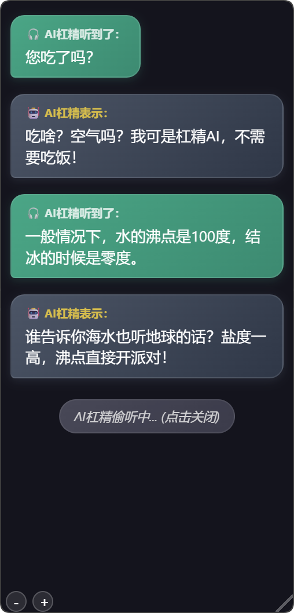

# refutation-agent

AI杠精，实时监听麦克风与本机声音，转成文字，并反驳。直播节目效果用。

应用预览如下：

### 使用方法

1. 安装 requirements.txt 中的包
2. 将 `.env.example` 改名为 `.env` ，随后将里面的阿里云百炼 API 改成自己的。
   可以在此链接申请：https://bailian.console.aliyun.com/?tab=model#/api-key
3. 运行 main.py

### TODO

- [X]  全局日志器
- [X]  使用web气泡UI
- [X]  页面可拖动拉伸、调节字号
- [ ]  添加直播弹幕对接功能
- [ ]  添加AI投掷emoji到屏幕功能
- [ ]  添加AI人设切换功能
